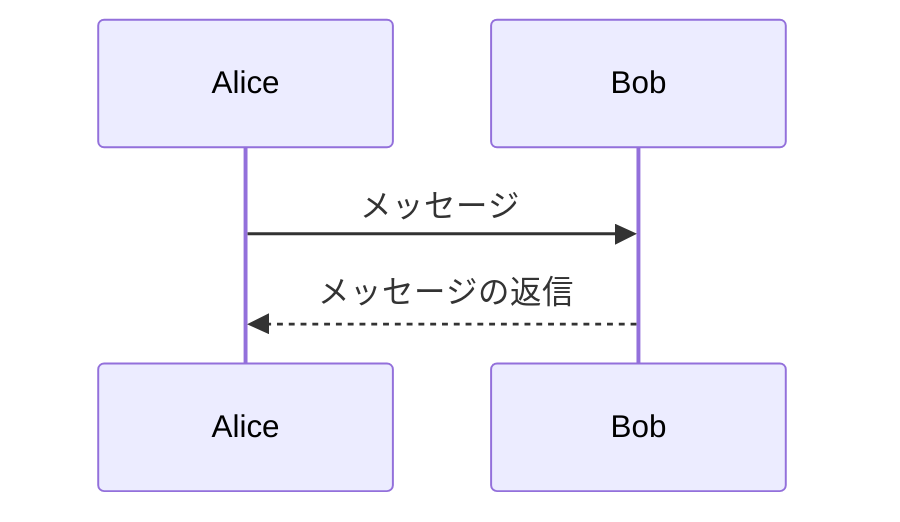

あけましておめでとうございます。
2025年もよろしくお願いします。

## ブログを移行した

[WordPress](https://wordpress.com/ja/) と [Gatsby](https://www.gatsbyjs.com/) を経て、結局 [Next.js](https://nextjs.org/) に落ち着きました。
WordPress は重いのとサーバーの維持費がかかっちゃうのがネックでした。
Gatsby はとにかくビルド時間が長いのが辛かったですね。

Next.js ではイイカンジのテンプレートがあったので、それを使わせてもらってます。
[timlrx/tailwind-nextjs-starter-blog | GitHub](https://github.com/timlrx/tailwind-nextjs-starter-blog)

このブログのソースはここにあります。ご参考までに。
[JichouP/blog.jichoup.com | GitHub](https://github.com/JichouP/blog.jichoup.com)

## うれしポイント

静的サイトとしてビルドできるので GitHub Pages にデプロイできるのが嬉しいですね。無料なので。
しかも、静的サイトのくせに、タグの管理や検索ができたり、リアクションやコメントを使えたりします。
ビルド時にタグの処理や検索のインデックスを作成したり、コメント管理をGitHub の Discussion のような外部サービスに切り出すことで、静的配信だけで済むようにできているんですね[^giscus]。賢い。

[^giscus]: コメントの管理には giscus を使っています。
[giscus](https://giscus.app/ja)

やってることは Next.js の SSG なので、GitHub Actions のテンプレートをそのまま使えるのも嬉しい[^gha]。
キャッシュも効いてるので、1分ちょいでビルドできます。（Gatsby だと 3分くらいかかってた記憶。。。）

[^gha]: ただし、このテンプレートにはデフォルトで GitHub Pages にデプロイする GitHub Actions が設定されているので、世話なしでした。

## 追加したい機能

OGPカードの設定をしたいですね。リンクを張ったときに、リンク先のページがカードとして表示されるやつです。
あとは、Mermaid.js でシーケンス図とかを書けるようにしたいです。

