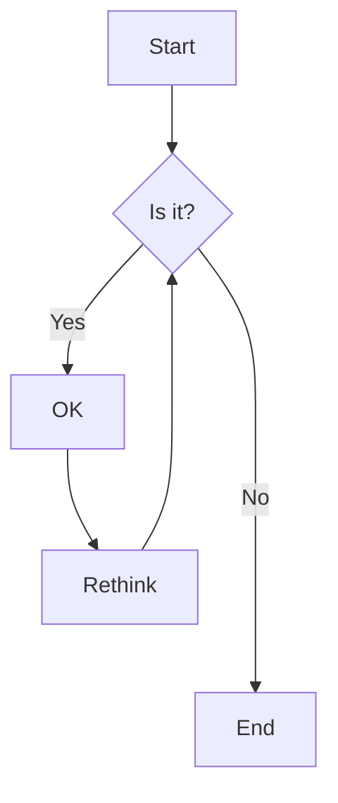
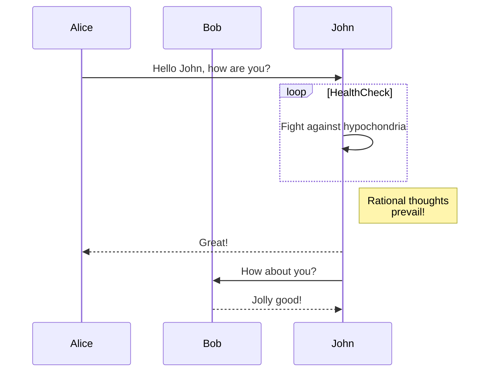
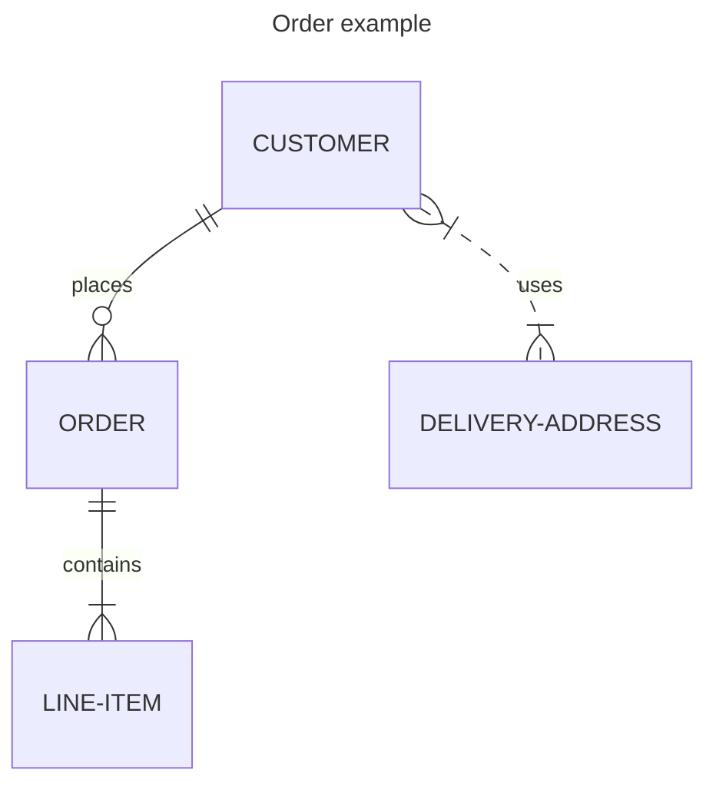
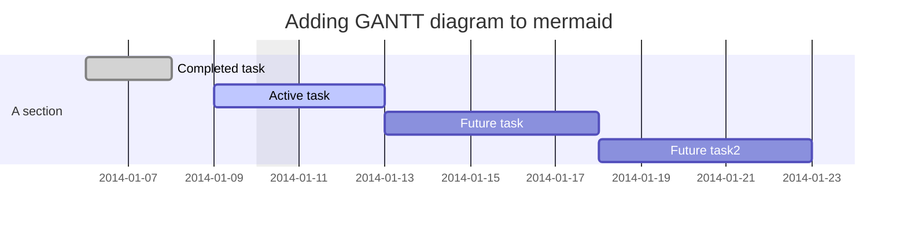
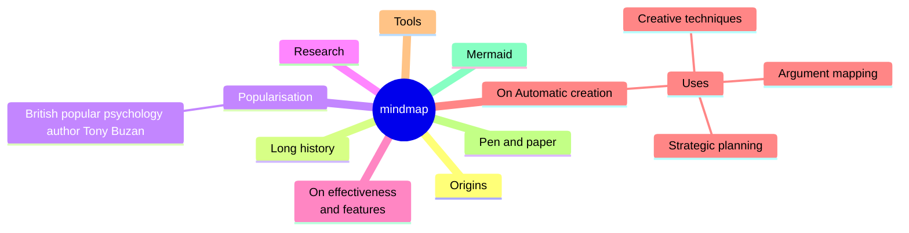
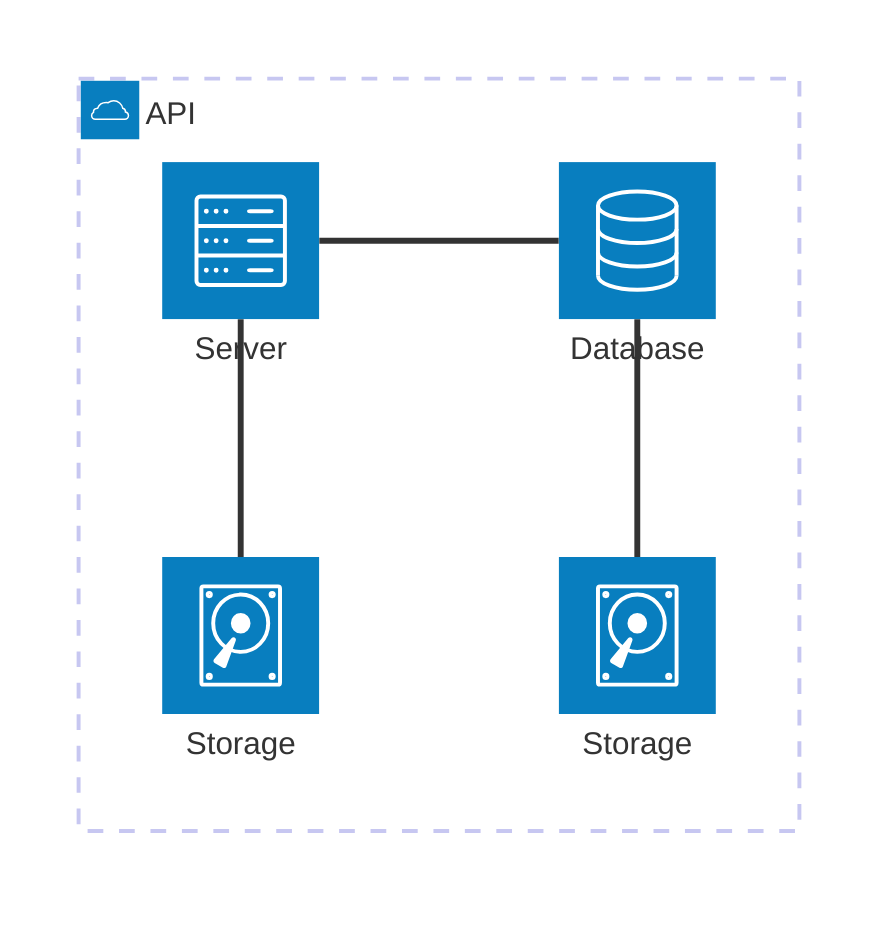

Mermaid をサポートしました。

## 実装

Mermaid のドキュメントに remark の Integrations が紹介されていたので、これを使用。
[Integrations | Mermaid](https://mermaid.js.org/ecosystem/integrations-community.html#:~:text=remark-,remark%2Dmermaidjs,-Sphinx)

### インストール

これを参考にインストール。Playwright は、Mermaid のレンダリングに使用される。
[remcohaszing/remark-mermaidjs | GitHub](https://github.com/remcohaszing/remark-mermaidjs)

```bash
yarn add remark-mermaidjs
yarn add playwright
npx playwright install --with-deps chromium
```

あとはプラグインを挿すだけ。

```diff
+ import remarkMermaid from 'remark-mermaidjs'
...
    remarkPlugins: [
      remarkExtractFrontmatter,
      remarkGfm,
      remarkCodeTitles,
      remarkMath,
      remarkImgToJsx,
      remarkAlert,
      remarkBreaks,
+     remarkMermaid,
    ],
```

シンプルでいいですね。

## 出来なかったこと

アーキテクチャ図で、AWS のアイコンを使いたかったけど、うまくロード出来なかった。
必要になったときにまた試してみます。（Figmaでいい気がするけど）

参考：[Registering icon pack in mermaid | Mermaid](https://mermaid.js.org/config/icons.html)

## サンプル

こんな感じで図が書けるようになった。（サンプルは公式ドキュメントより）

### フローチャート



### シーケンス図



### ER図



### ガントチャート



### マインドマップ



### アーキテクチャ



